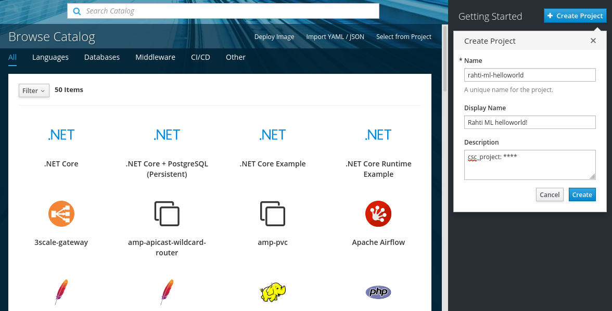
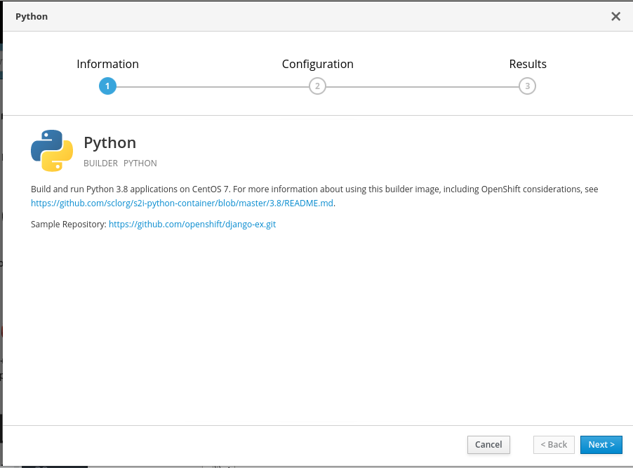
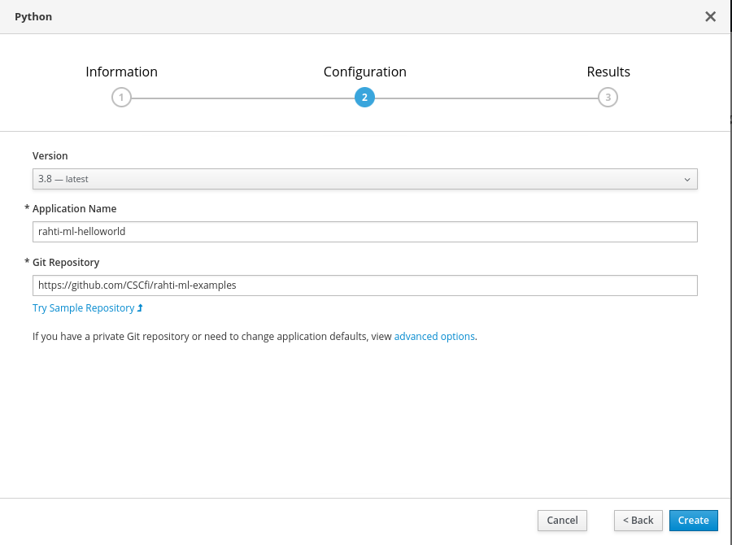
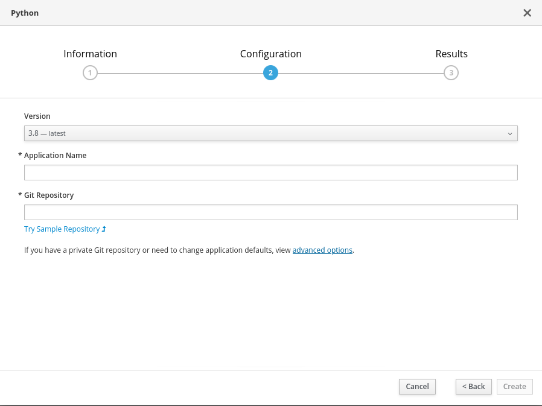
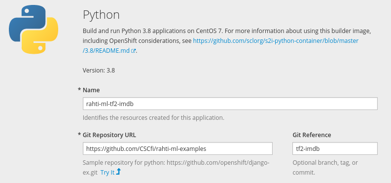

# Rahti machine learning deployment examples

This repository contains several simple examples of how to deploy machine learning inference jobs as a service on [CSC's Rahti](https://rahti.csc.fi/) container cloud:

- [Minimal Python service](#minimal-python-service-on-rahti)
- [Deploying TensorFlow 2 sentiment detection model](#deploying-tensorflow-2-sentiment-detection-model)
- [PyTorch: BERT with ONNX](#pytorch-bert-with-onnx)
- [Example dashboard using Dash](#example-dashboard-using-dash)
- [Example dashboard using Streamlit](#example-dashboard-using-streamlit)
- [Turku neural parser pipeline](#turku-neural-parser-pipeline)

If you are unfamiliar with Rahti and how to get access, first check [Rahti's documentation](https://rahti.csc.fi/).

The steps for running a service like this on Rahti go like this:

1. Set up a GitHub repository with your code, plus a few extra files needed by Rahti to run the code (more on this in the examples below).

2. Create a new Application in Rahti by selecting "Python" in the Service Catalog and pointing that to your GitHub repository.

3. Wait for Rahti to build your application and start it up... and (hopefully) enjoy your new service :-)

Next, we'll go through this in more detail, setting up a minimal Python web service.

## Minimal Python service on Rahti

### Step 1: GitHub repository

The `master` branch of this repository contains a minimal Python service that can be run on Rahti.  You can either use this repository directly, or make your own fork.  As you can see, we have two files: 

- [requirements.txt](requirements.txt), which says what Python packages Rahti should install when building the image.  In this minimal example we only use gunicorn and flask which are needed for setting up the web service itself.

- [wsgi.py](wsgi.py), which is the server script itself.  We are using [Flask](https://www.palletsprojects.com/p/flask/) which is a lightweight web application framework for Python.  As you can see from the code it's rather simple to set up different routes for the server to respond to.  Our example service responds with a simple "Hello, world" JSON if you do a HTTP GET request.

### Step 2: Create application in Rahti

Head to <https://rahti.csc.fi/> and click the link to the "Rahti web user interface", and log in with your CSC account.

Create a new project by clicking "Create Project". Specify your project name, and add "csc_project: " followed by the name or number of your CSC computing project in the Project description field. 



After that, get started with your project and click "Browse Catalog". 
From the Service Catalog select "Python".

In the screen you will see some useful links, in particular the first one tells about the [settings for the Python container image](https://github.com/sclorg/s2i-python-container/blob/master/3.8/README.md), which can be useful for more advanced setups.  In particular, the [different ways to execute your application](https://github.com/sclorg/s2i-python-container/blob/master/3.8/README.md#run-strategies) can be useful information. For now, just click next.



In the next screen, fill in configuration details for your application: give a name for your application (which will be a part of app public address), and point to your GitHub repository.



Continue to the project overview to check the status of your application as it builds and deploys.

### Step 3: Wait and hope for the best :-)

After this Rahti will build your application and if everything goes well deploy it at something like `http://appname-projectname.rahtiapp.fi` in a few minutes. Now you can try it out, for example in a web browser, or from a unix shell:

```bash
$ curl http://appname-projectname.rahtiapp.fi/
{"msg":"Hello, World!"}
```

If you have errors, take a look at the build log.  If the build goes fine, but it still doesn't work take a look at the pod logs, in case there was some error when starting the server.  For more details see the [Rahti basic deployment documentation](https://rahti.csc.fi/tutorials/basic-console/).

## Deploying TensorFlow 2 sentiment detection model

The [`tf2-imdb` branch](https://github.com/CSCfi/rahti-ml-examples/tree/tf2-imdb) of this repository contains an example of deploying a pre-trained sentiment detection model using `tf.keras`.

The main changes here is that the main code is in a separate file [`tf2_imdb.py`](https://github.com/CSCfi/rahti-ml-examples/blob/tf2-imdb/tf2_imdb.py), and [`wsgi.py`](https://github.com/CSCfi/rahti-ml-examples/blob/tf2-imdb/wsgi.py) simply calls functions from there.

The pre-trained model is downloaded from [CSC's Allas object storage service](https://docs.csc.fi/#data/Allas/). This part requires some tricks as we start several processes in parallel to handle multiple HTTP requests, but we don't want them all to download the files.  The file downloading code can be found in [`rahti_utils.py`](https://github.com/CSCfi/rahti-ml-examples/blob/tf2-imdb/rahti_utils.py).

**NOTE:** Setting up with Rahti is the same as with the previous Minimal Python example, except that when giving the URL of the GitHub repository, you need to click "advanced options" and give the name of then branch in the "Git Reference" field (as it otherwise will default the main branch):






## PyTorch: BERT with ONNX

The [`onnx-imdb` branch](https://github.com/CSCfi/rahti-ml-examples/tree/onnx-imdb) of this repository contains an example of deploying a pre-trained BERT model for sentiment detection using PyTorch and the [Transformers library](https://huggingface.co/transformers/).  The pre-trained model has been saved in the [ONNX format in PyTorch](https://pytorch.org/docs/stable/onnx.html).

The main code can be found in [`onnx_imdb.py`](https://github.com/CSCfi/rahti-ml-examples/blob/onnx-imdb/onnx_imdb.py).

**NOTE:** Setting up with Rahti is the same as with the previous examples, but note that inference with BERT is quite heavy, and you might need to add more cores to your pods and container in Rahti.

## Example dashboard using Dash

The [`dash` branch](https://github.com/CSCfi/rahti-ml-examples/tree/dash) of this repository contains an example dashboard built using [Dash](https://plotly.com/dash/).

The dashboard code is in a file [`app.py`](https://github.com/CSCfi/rahti-ml-examples/blob/dash/app.py).

**NOTE:** Setting up with Rahti is the same as with the Minimal Python example, except that when giving the URL of the GitHub repository, you need to click "advanced options" and give the name of then branch in the "Git Reference" field (as it otherwise will default the main branch).

## Example dashboard using Streamlit

The [`streamlit` branch](https://github.com/CSCfi/rahti-ml-examples/tree/streamlit) of this repository contains an example dashboard built using [Streamlit](https://streamlit.io/).

The dashboard code is in a file [`streamlit-iris.py`](https://github.com/CSCfi/rahti-ml-examples/blob/streamlit/streamlit-iris.py) and there is a separate file [`app.sh`](https://github.com/CSCfi/rahti-ml-examples/blob/streamlit/app.sh) that launches the application.

**NOTE:** Setting up with Rahti is the same as with the Minimal Python example, except that when giving the URL of the GitHub repository, you need to click "advanced options" and give the name of then branch in the "Git Reference" field (as it otherwise will default the main branch).

## Turku neural parser pipeline

Running the [Turku neural parser pipeline](http://turkunlp.org/Turku-neural-parser-pipeline/) in server mode on Rahti is pretty easy.  Just fork the [original GitHub repository](https://github.com/TurkuNLP/Turku-neural-parser-pipeline) and add a new file [`app.sh`](https://github.com/mvsjober/Turku-neural-parser-pipeline/blob/master/app.sh) which handles downloading models and starting the server. 

Here you can see an example of a working repository: <https://github.com/mvsjober/Turku-neural-parser-pipeline>. Take a look at the commits for what changes are needed. For example you might have to tweak the `requirements.txt` a bit.
